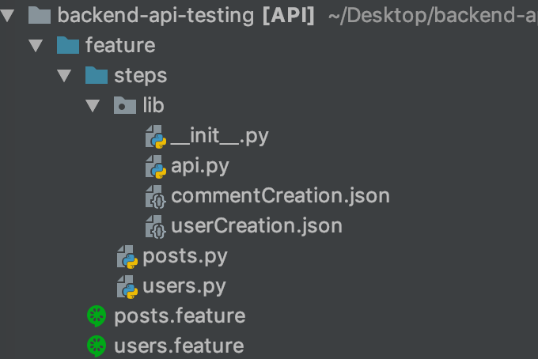

### Setting Up
Requirement:

1. Clone the repo from GitHub 

```
Git clone:
```
2. Install the below dependencies 
```
Language used - python(3.6) 
BDD framework - behave(1.2.6) 
REST API      - request(2.20.0) 
pycharm IDE(optional)
```

3. Once installed initialise the directory and navigate to the backend-api-testing/feature in your terminal or command prompt

  

4. Execute the scenario required using the tags

``
behave --tags @TC_POSTS_01 
``

5. You can see the results in the terminal 

Video has been attache 

